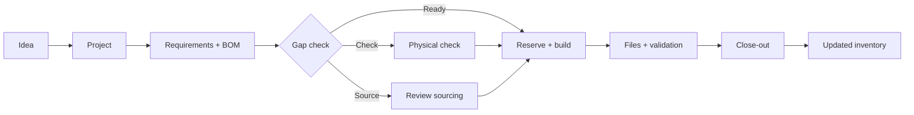

<p align="center">
  
</p>

<p align="center"><strong>Your workshop's memory, project brain and AI-ready maker workspace.</strong></p>

<p align="center">
  BenchLedger helps 3D-printing and electronics makers go from <em>idea → parts → build → finished project</em><br>
  without losing track of what they own, what they need, or why a decision was made.
</p>

<p align="center">
  
  
  
  
</p>

> [!NOTE]
> BenchLedger is an early open-source release. The core private-LAN workflow works today, but APIs, schemas and MCP capabilities may change before 1.0.


## Why BenchLedger exists

Maker projects get messy fast. The CAD file is in one folder. The printer profile is somewhere else. You *think* you still have the right filament. A part was ordered three months ago, but did it arrive? The BOM changed after revision two. An AI agent can help, but only if it has trustworthy context.

BenchLedger gives the workshop one shared source of truth.

- **Know what you actually have.** Track printers, tools, filament, electronics, fasteners, spares and consumables with explicit evidence states.
- **Plan builds properly.** Keep requirements, BOMs, revisions, fabrication routes, build setup and gaps together.
- **Source what is missing.** Review recorded supplier offers, package quantities, prices and alternatives without pretending an order equals stock.
- **Keep files tied to the build.** Store versioned CAD, STEP, STL, 3MF, firmware, drawings and validation artefacts against project revisions.
- **Close the loop.** Record what was used, returned, lost, left over or converted into a new workshop asset.
- **Let AI help safely.** Authorised agents use the same application rules and approval boundaries as the web UI through MCP.

## Built for real maker workflows

BenchLedger is deliberately opinionated about uncertainty. **Bought** is not the same as **on hand**. **Looks compatible** is not the same as **verified**. **Recommended** is not the same as **approved**.

That lets the interface stay simple for everyday use while preserving expert detail when you need it.

| Maker view | What it means |
| --- | --- |
| **Ready** | BenchLedger has enough evidence to use it |
| **Check** | A physical count or compatibility check is needed |
| **Decide** | The project needs a maker decision |
| **Source** | The project has a confirmed gap |

Technical mode exposes exact variants, dimensions, lots, provenance, revision scope, build configuration, hashes and audit history.
## From idea to finished build



The current release includes guided project setup, reviewed BOM imports, project corrections with retained history, inspection queues, sourcing review, revision-aware artefacts, interruption-safe saves and post-build reconciliation.

## AI-native, not AI-dependent

BenchLedger works perfectly well as a normal web application. If you use ChatGPT, Codex, Claude or another MCP-capable agent, the same workspace can also become structured maker context.

An authorised agent can inspect inventory, calculate project gaps, prepare sourcing proposals, manage revisions and artefact metadata, and draft close-out reconciliation. It cannot silently purchase products, publish files, purge history, control your printer or bypass physical verification.

That distinction matters: **the agent helps run the workflow; BenchLedger remains the system of record.**

See the [10-minute agent quickstart](docs/agent-quickstart.md), [capability map](docs/capability-map.md) and bundled [`$benchledger` skill](skills/benchledger/SKILL.md).

## Try it locally

Requirements: **Node.js 24+** and **npm 11+**.

```bash
git clone https://github.com/newtonlorenz/benchledger.git
cd benchledger
npm ci
npm run build
npm run dev
```

Open [http://127.0.0.1:8792](http://127.0.0.1:8792).

Development mode uses synthetic demo data, including a Bambu Lab H2D workshop example. The demo is password-protected and never requires private inventory data. For a production-like private-LAN installation with persistent storage, use the [deployment guide](docs/deployment.md).

## What you can manage

- Printers, filament, tools, accessories, electronics, fasteners, wire and spare parts
- Exact product profiles, variants and compatibility evidence
- Physical counts, reservations, uncertainty and unavailable stock
- Projects, requirements, revisions, BOMs and build approaches
- Supplier offers, alternatives and sourcing decisions
- CAD, STEP, STL, 3MF, firmware, drawings and validation files
- Immutable build configuration snapshots and SHA-256 hashes
- Inspection actions and physical verification
- Project close-out, leftovers, losses, returns and newly created assets

BenchLedger does **not** slice models, generate G-code, control printers, scrape retailers or purchase products.
## Architecture

BenchLedger is a TypeScript modular monolith with one set of application rules behind every surface.

```text
React + Vite web UI ─┐
Fastify HTTP API ────┼─> application services ─> domain rules
MCP adapter ─────────┘          │                    │
                               ├─> SQLite repositories
                               └─> content-addressed artefact storage
```

The UI, HTTP API and MCP adapter do not write directly to SQLite or the filesystem. Start with the [capability map](docs/capability-map.md), [stock evidence semantics](docs/stock-evidence-semantics.md) and [approval boundaries](docs/approval-boundaries.md) if you are extending the system.

## Project status

**Working now:** private-LAN app, authentication, guided setup, inventory and exact product profiles, project planning, reviewed sourcing, inspection workflows, revisioned artefacts, backups, scoped MCP access and post-project reconciliation.

**Pre-1.0:** APIs and schemas may still change. There are no published npm packages or hosted service guarantees yet.

See [CHANGELOG.md](CHANGELOG.md), [reviewed maker workflows](docs/maker-workflows.md) and the [open-source readiness review](docs/open-source-readiness.md).

## Contributing

BenchLedger is being built in public for people who make physical things. Useful contributions include workflow friction you hit in a real workshop, support for additional maker domains, accessibility improvements, tests, documentation and focused code changes.

A good first contribution does not need to be large. If something feels confusing while you are setting up a printer, checking stock or planning a build, open an issue with the workflow you were trying to complete.

Start with [CONTRIBUTING.md](CONTRIBUTING.md), the [Code of Conduct](CODE_OF_CONDUCT.md), [development workflow](docs/development-workflow.md) and [support guide](SUPPORT.md).

Before submitting a change, run the smallest relevant tests. The complete release gate is:

```bash
npm run check
```

## Privacy by design

Real workshop data stays outside the source tree. Do not commit private inventory, project artefacts, supplier history, order identifiers, `.env` files, credentials, SQLite databases, logs, backups or private exports.

Read [Privacy](docs/privacy.md) and [Security](SECURITY.md), and run `npm run public:check` before sharing a branch or source archive.

## Licence

BenchLedger is open source under the [Apache License 2.0](LICENSE).

<p align="center"><strong>Build things. Keep the context. Make the next project easier.</strong></p>
