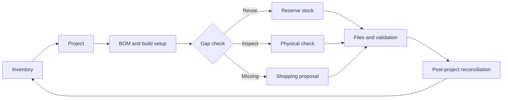
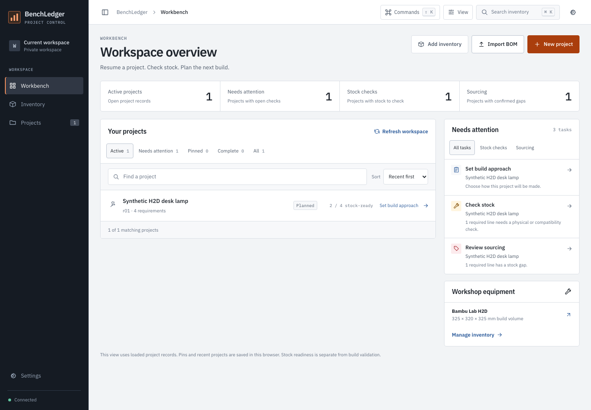

<p align="center">
  
</p>

<p align="center"><strong>Know what you have. Plan what to build. Close the loop.</strong></p>

<p align="center">
  A self-hosted inventory and project workspace for 3D printing, CAD, electronics, and AI-assisted making.
</p>

> [!NOTE]
> BenchLedger is an early open-source release. The private-LAN workflow is
> working, but APIs, schemas, and MCP capabilities may change before 1.0.

## Why BenchLedger

Maker projects usually split their truth across shopping history, drawers,
spreadsheets, slicer files, CAD folders, and memory. BenchLedger brings that
information together so a person or an AI agent can answer three useful
questions:

1. What equipment, tools, materials, and parts are actually available?
2. What does this project need, and what can be reused with confidence?
3. What is missing, where could it be sourced, and what might it cost?

It treats uncertainty honestly. An old order is evidence that something was
bought, not proof that it is still on hand. A compatible-looking part is a
candidate, not an exact match. Every recommendation can retain the reason,
source, observation time, and next physical check.

## What it does

- Tracks printers, tools, accessories, spare parts, electronics, and consumables
- Keeps exact product profiles for printers, filament, nozzles, plates, and parts
- Uses an append-only stock ledger with confirmed, uncertain, reserved, and
  unavailable states
- Plans projects with work items, revisions, BOMs, reuse decisions, and gaps
- Compares supplier offers, package quantities, observed prices, and alternatives
- Stores versioned CAD, STEP, STL, 3MF, firmware, drawing, and validation files
- Binds build configurations and SHA-256 hashes to project revisions
- Reconciles actual use, returns, loss, leftovers, and converted assets after a build
- Gives the web app and MCP clients the same application rules and approval boundaries

BenchLedger does **not** purchase products, scrape retailers, execute uploads,
slice models, generate G-code, or control printers.

## A project from idea to close-out



Beginners see plain outcomes such as **Ready to use**, **Check quantity**, and
**Need to buy**. Expert detail is available in place: exact variants, dimensions,
lots, compatibility evidence, build configuration, hashes, and audit history.



### Set up inventory categories

Open **Settings → Manage inventory categories** before adding stock. Add a
top-level category such as “Workshop” or “Electronics”; you can add one level of
subcategories such as “Workshop / Measuring tools”. Rename or change the order
when your storage changes, or archive a category that should no longer be used.

When you choose **Inventory → Add item**, select the item type first and then an
active managed category. The item type remains the semantic kind used for
matching (for example, `tool` or `electronic`); the managed category is the
display label and is used by the Category filter. Existing legacy items can stay
unassigned until you edit them. If no category is available, the add form links
back to Settings so you can create one before continuing.

## Five-minute local demo

Requirements: Node.js 24 LTS and npm 11 or later.

```bash
npm ci
npm run dev
```

Open [http://127.0.0.1:8792](http://127.0.0.1:8792). Development mode uses
synthetic demo data; never copy a private inventory database into the checkout.
The demo remains password-protected. A fresh trusted-LAN deployment with no
bootstrap password hash starts with browser access in `lan_open` mode; use that
mode only when every device on the network is trusted. An administrator can
enable `password` mode in Settings.

For a production-like LAN installation with external persistent storage, follow
the [deployment guide](docs/deployment.md).

## Agent and MCP access

BenchLedger is agent-native rather than agent-only. The model-neutral MCP server
offers bounded resources and scoped tools over the same application service used
by the web UI.

Use the bundled [`$benchledger` skill](skills/benchledger/SKILL.md) when your
runtime supports skills. Otherwise begin with the
[ten-minute agent quickstart](docs/AGENTS.md) and
[capability map](docs/capability-map.md).

Agents can inspect inventory, calculate BOM gaps, prepare shopping proposals,
manage revisions and artifacts, and draft project close-out reconciliation. They
cannot buy, publish, purge permanently, control a printer, or bypass physical
verification. Browser access mode does not grant MCP access: `/api/v1/mcp`
always requires a scoped bearer token, including when the browser is in
`lan_open` mode.

## Architecture

BenchLedger is a TypeScript modular monolith:

```text
React + Vite web UI ─┐
Fastify HTTP API ────┼─> application services ─> domain rules
MCP adapter ─────────┘          │                    │
                               ├─> SQLite repositories
                               └─> content-addressed artifact storage
```

The UI, HTTP API, and MCP adapter never write to SQLite or the filesystem
directly. See the [capability map](docs/capability-map.md),
[stock semantics](docs/stock-evidence-semantics.md), and
[approval boundaries](docs/approval-boundaries.md) for the public contract.

## Repository map

| Path | Purpose |
| --- | --- |
| `apps/web` | Responsive beginner-to-expert interface |
| `apps/server` | Fastify API, auth, OpenAPI, and application host |
| `apps/mcp` | Model-neutral MCP adapter and protocol boundary |
| `packages/domain` | Evidence-aware inventory and project rules |
| `packages/application` | Use cases and ports shared by every surface |
| `packages/database` | SQLite schema and repositories |
| `packages/artifacts` | Content-addressed project file storage |
| `skills/benchledger` | Portable workflow skill for compatible agents |
| `docs` | Semantics, deployment, privacy, roadmap, and reference workflow |

## Private data stays outside the repository

This source tree contains application code, documentation, deployment examples,
and synthetic fixtures only. Do not commit real inventory, project artifacts,
supplier history, order/message identifiers, `.env` files, credentials, SQLite
databases, logs, backups, or private exports.

Read [Privacy](docs/privacy.md) and [Security](SECURITY.md) before importing data.
Run `npm run public:check` before sharing a branch or source archive.

## Contributing

Focused issues and pull requests are welcome.
Start with [CONTRIBUTING.md](CONTRIBUTING.md), the
[Code of Conduct](CODE_OF_CONDUCT.md), [development workflow](docs/development-workflow.md),
and [support guide](SUPPORT.md).

During development, test the smallest affected surface. The complete release
gate is:

```bash
npm run check
```

## Project status

- **Working:** private LAN app, external data boundary, authentication, scoped
  MCP, projects/BOMs, exact product profiles, revisioned artifacts, backups, and
  post-project reconciliation
- **Pre-release:** APIs and schemas may still change; there are no published npm
  packages or stable compatibility guarantees
- **Not yet published:** npm packages or a hosted service

See [CHANGELOG.md](CHANGELOG.md) and the
[open-source readiness review](docs/open-source-readiness.md).

## License

Licensed under the [Apache License 2.0](LICENSE).
