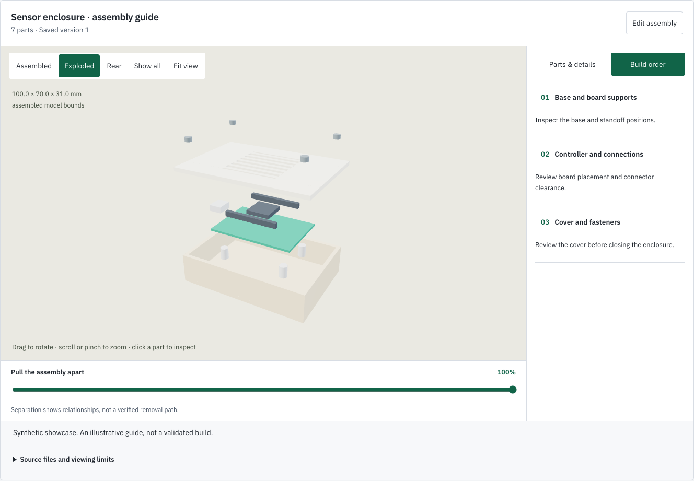
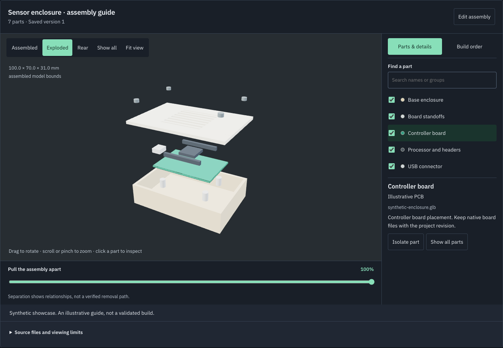
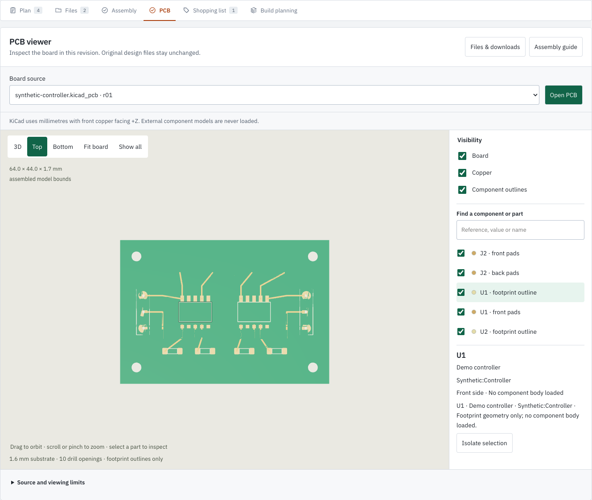
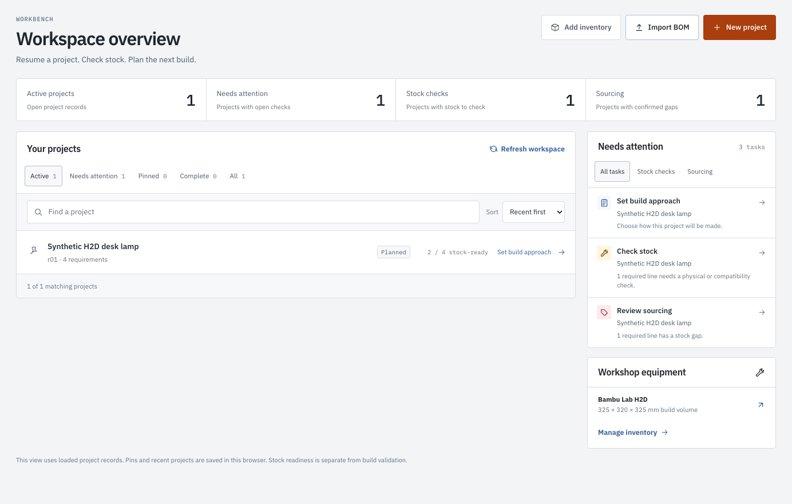
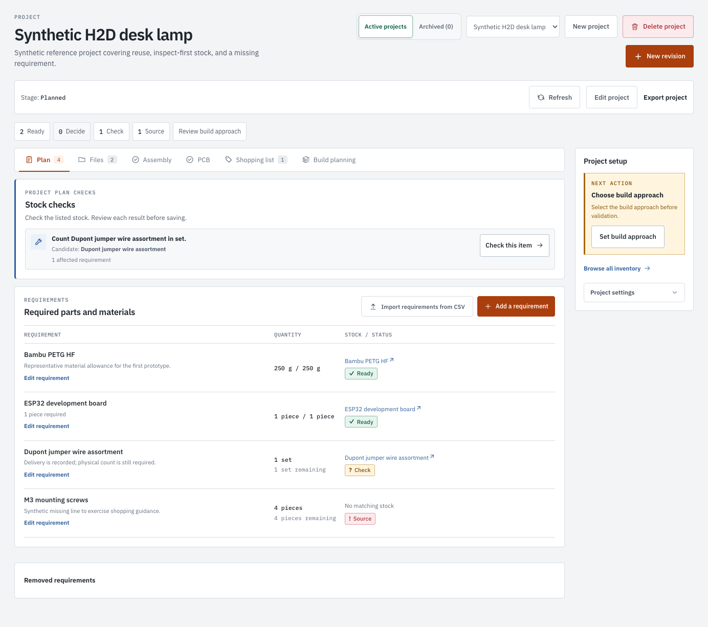

<p align="center">
  
</p>

<h3 align="center">From parts drawer to finished build.</h3>

<p align="center">Your inventory, BOM, CAD assembly, PCB and build plan — in one project.<br>A self-hosted, open-source workshop for people and MCP agents.</p>

<p align="center">
  <a href="https://github.com/newtonlorenz/benchledger/actions/workflows/check.yml"></a>
  <a href="LICENSE"></a>
  
  
  <a href="docs/agent-quickstart.md"></a>
</p>

<p align="center"><a href="#try-it-locally">Quickstart</a> · <a href="#see-it-in-action">Showcase</a> · <a href="docs/assembly-explorer.md">CAD</a> · <a href="docs/pcb-viewer.md">PCBs</a> · <a href="docs/agent-quickstart.md">Connect an agent</a> · <a href="CONTRIBUTING.md">Contribute</a></p>



*Actual app screenshots using synthetic demo data. The sample enclosure is illustrative, not a validated design.*

> [!NOTE]
> **Early open-source release.** The app works locally and on a private LAN. APIs and schemas may change before 1.0; there is no managed hosted service.

## Your build, connected

A board belongs with its enclosure. An enclosure belongs with its parts list. A parts list should know what is already in your workshop.

BenchLedger keeps that context together, from the first requirement to the stock left after a build. Open it in a browser, connect an MCP agent, or use both against the same project records.

| In your project | What you can do today |
| --- | --- |
| **Inventory & equipment** | Search electronics, filament, fasteners, tools and printers. Organise categories, images and locations; track exact product variants and separate ordered, delivered and counted stock. |
| **BOM & readiness** | Start from a template or review a CSV import. See **Ready / Check / Decide / Source** requirements, inspect alternatives and reserve confirmed parts. |
| **CAD & assembly guides** | Inspect STEP, GLB and STL, select or isolate parts, explore exploded views, and save placements, requirement links and build steps. |
| **PCB inspection** | Open native KiCad boards or STEP/GLB exports within the project. Inspect top/bottom views, supported copper, drills and footprint outlines. |
| **Files & revisions** | Keep CAD, firmware, drawings and slicer files with exact project or workstream revisions. Preview supported files and download originals with integrity checks. |
| **Build planning** | Record repeated parts, plates, run counts, materials, nozzle side and time estimates. Track workstreams and retain planning snapshots. |
| **Sourcing & close-out** | Compare dated supplier quotes with pack sizes, currencies and missing costs visible. Review actual usage, returns and leftovers before updating stock. |
| **HTTP API & MCP** | Read gaps, inspect geometry and prepare plans through shared application rules, scoped access, version checks and audit history. |

[Full capability map](docs/capability-map.md) · [Maker workflows](docs/maker-workflows.md)

## See it in action

### Pull the assembly apart. Keep the build together.

Select a part, isolate it, search by name, or move between assembled and exploded views. Save an assembly guide with materials, fixing notes, linked requirements and a build order. The source CAD stays intact.

<details>
<summary>See the same assembly in dark mode</summary>



</details>

[Explore the assembly viewer](docs/assembly-explorer.md) · [Download the sample enclosure](docs/assets/showcase/synthetic-enclosure.glb)

### The PCB is part of the project

Open a board from **Files → PCB** without leaving its build context. Rotate it, switch between top and bottom, show or hide copper and footprint outlines, then search for a reference or value to inspect a component.



The native reader uses the board's declared dimensions, supported outer copper, drills and footprint drawings. **Footprint outlines are not component bodies.** Missing models and unsupported geometry are reported; use a self-contained STEP/GLB export when detailed bodies or filled zones matter. This is inspection, not PCB editing or DRC.

The same source can join enclosure geometry in **Assembly**. MCP agents inspect the same revision and file hash through `inspect_assembly_sources`.

[PCB support and limits](docs/pcb-viewer.md) · [Download the synthetic KiCad board](docs/assets/showcase/synthetic-controller.kicad_pcb)

### Know what you have. See what is missing.

The workbench brings projects, equipment and next actions together. Open a project to review its requirements: ready to use, needs a physical check, needs a decision, or needs sourcing. Uncertain stock stays uncertain until evidence changes it.





Reviewed CSV imports, requirement filters, supplier quotes, plate plans and independent workstreams support larger builds. Stock close-out records what was used, returned or left over through an explicit review. Technical mode exposes exact identities, units, provenance and history.

### Give your agent the same project context

Use BenchLedger as a web app, or connect an MCP-capable client to help with the work:

> “Read this project's current revision and BOM. Inspect the board and enclosure files, draft an assembly order, and list the checks we still need before sourcing anything.”

Agents can inspect source parts, calculate gaps, record supplier observations and save plans through the same application services. Typed tools preserve project scope, exact file hashes, optimistic concurrency and audit history. Purchasing, physical verification and printer operation remain separate decisions.

[Connect an agent](docs/agent-quickstart.md) · [MCP setup and tools](apps/mcp/QUICKSTART.md) · [Bundled agent skill](skills/benchledger/SKILL.md)

### Bring your existing files

| Source | Viewing support |
| --- | --- |
| **KiCad `.kicad_pcb`** | Supported board outline, thickness, drills, outer copper and footprint geometry; reference/value metadata. |
| **STEP / STP** | Separate solids, placements and hierarchy where present; declared units converted to millimetres. |
| **GLB** | Static meshes, nested transforms, repeated placements and illustrative colours; bounded support for fragmented CAD exports. |
| **STL** | One part per file, with explicit units and editable placement in Assembly. |
| **Images, Markdown, text** | In-project previews; other stored formats remain downloadable. |

Exploded positions illustrate relationships, not a verified removal path. PCB and CAD views do not establish mechanical fit, electrical safety or manufacturing readiness.

All showcase images are fresh captures of the shipped app using synthetic data. [Capture details and reproducible sample files](docs/showcase.md).

## Try it locally

Requirements: **Node.js 24** and **npm 11+**.

```bash
git clone https://github.com/newtonlorenz/benchledger.git
cd benchledger
npm ci
npm run build
npm run dev
```

Open **[http://127.0.0.1:8792](http://127.0.0.1:8792)** and sign in with the demo password:

```text
demo-password-please-change
```

This starts a **synthetic, in-memory demo**. Its data resets when the server restarts. The demo password is public and is not a credential for a persistent installation.

Try the two examples in a demo project:

1. **Exploded CAD:** upload [synthetic-enclosure.glb](docs/assets/showcase/synthetic-enclosure.glb) in **Files**, then open **Assembly**. In **Coordinates**, select **metre** and **Z up**. Choose **Open assembly → Exploded**.
2. **Native PCB:** upload [synthetic-controller.kicad_pcb](docs/assets/showcase/synthetic-controller.kicad_pcb) in **Files**, open **PCB**, select the board and choose **Open PCB**. Units and orientation are handled automatically.

These are illustrative viewing examples, not validated designs. Stock close-out is available in persistent installations; the lightweight demo does not advertise it.

For persistent storage, authentication and backups, follow the [self-hosting and deployment guide](docs/deployment.md). MCP connections use scoped bearer tokens even when the browser is configured for trusted-LAN access.

## How it works

BenchLedger is a TypeScript modular monolith with one set of application rules behind its interfaces.

```text
React + Vite web UI ─┐
Fastify HTTP API ────┼─> application services ─> domain rules
MCP adapter ─────────┘          │                    │
                               ├─> SQLite repositories
                               └─> content-addressed artifact storage
```

CAD and PCB geometry is derived for viewing; saved guides use the existing versioned workflow store. STEP conversion uses `occt-import-js` / Open CASCADE; rendering uses Three.js. See [format support and dependency licences](docs/assembly-explorer.md#implementation-and-distribution).

BenchLedger does not slice models, generate G-code, control printers, scrape retailers or place orders.

## Help shape BenchLedger

Try it on a maker workflow and tell us where it breaks down. Useful contributions include clearer first-run guidance, reproducible CAD import bugs, accessibility fixes, additional maker workflows and focused tests.

- [Report a reproducible bug](https://github.com/newtonlorenz/benchledger/issues/new?template=bug_report.yml)
- [Suggest a workflow or feature](https://github.com/newtonlorenz/benchledger/issues/new?template=feature_request.yml)
- [Browse good first issues](https://github.com/newtonlorenz/benchledger/issues?q=is%3Aissue%20is%3Aopen%20label%3A%22good%20first%20issue%22)
- [Read the contributing guide](CONTRIBUTING.md)

Building something with BenchLedger? **Share a screenshot and a link to your project** in [Discussions](https://github.com/newtonlorenz/benchledger/discussions). Public examples help other makers discover what is possible. Star the repository to keep it handy, or send it to someone with a parts drawer that needs organising.

Before contributing, read the [Code of Conduct](CODE_OF_CONDUCT.md), [development workflow](docs/development-workflow.md) and [support guide](SUPPORT.md). Run focused checks while iterating and `npm run check` before review.

## Privacy and licence

Public examples use synthetic data. Keep real inventory, private project files, supplier history, credentials, databases and backups outside the source tree. Read [Privacy](docs/privacy.md) and [Security](SECURITY.md); run `npm run public:check` before sharing source.

BenchLedger's own code is licensed under [Apache 2.0](LICENSE). Dependencies retain their respective licences.

[Changelog](CHANGELOG.md) · [Maker workflows](docs/maker-workflows.md) · [Open-source readiness](docs/open-source-readiness.md)
